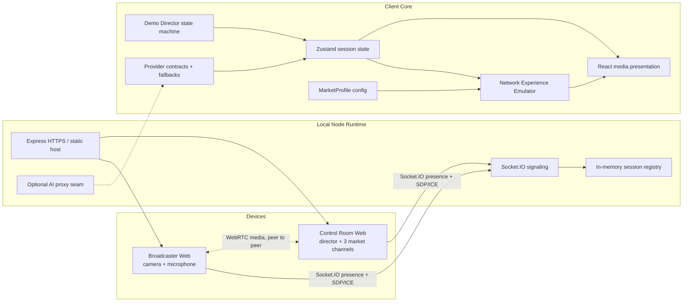

# OneLive Architecture

## 1. 架构目标

OneLive 的架构首先服务于现场可靠性：

- Mock Demo 与外部 AI、手机和互联网解耦。
- 真实设备、模拟网络和 UI 展示层相互隔离。
- 每个指标携带 LIVE 或 EMULATED 来源语义。
- 增加第四个市场时主要修改配置，不重写控制台。
- 运营商 QoD、MEC 和真实 AI Provider 通过接口替换，而不是侵入 UI。
- 比赛 Mock Demo 的四段预生成视频完全本地加载，不依赖网络、AI API 或浏览器 TTS。

## 2. 系统视图

实线表示本地应用数据流；WebRTC 媒体和可选 AI 使用虚线，是因为其可用性取决于浏览器、网络、证书和 Provider 配置。Mock 主链路不依赖虚线部分。

## 3. 目录与职责

| 路径                           | 职责                                                               |
| ------------------------------ | ------------------------------------------------------------------ |
| src/config/markets.ts          | 三市场的语言、视觉、优先级和带宽需求                               |
| src/config/demoMedia.ts        | 中文原视频与三个本地化视频、海报和来源标签                         |
| src/config/scripts.ts          | 中文演示台词与三语预置翻译                                         |
| src/core/types.ts              | 网络、频道、姿态和导演状态的领域类型                               |
| src/core/network.ts            | Network Profile、资源分配、频道降级、体验快照与 sender constraints |
| src/core/director.ts           | 六步 Demo Director 预设和状态边界                                  |
| src/providers/contracts.ts     | Speech、Translation、TTS、Avatar、Network Capability 接口          |
| src/providers/demoProviders.ts | 预置翻译、浏览器 TTS、程序化姿态和模拟 QoD Provider                |
| src/store/useOneLiveStore.ts   | 会话、源、网络、部署模式、QoD、视图和导演状态                      |
| src/features/control-room      | 左侧原视频、右侧市场切换舞台、网络路径和保留的 Source Tools        |
| src/realtime/protocol.ts       | Socket.IO 与 WebRTC 信令的类型化协议                               |
| server/session-registry.ts     | control / broadcaster 短期会话存在状态                             |
| server/signaling.ts            | 加入会话、角色约束、SDP/ICE 转发和 source command/state            |
| server/index.ts                | HTTP(S) 服务、Vite/静态资源、Socket.IO 与运行时配置装配            |
| tests                          | 领域模型、Provider、信令和端到端行为测试                           |

目录会随实现迭代，但边界不应改变：配置、领域逻辑、Provider、实时通信、UI 和服务端装配保持分离。

## 4. 运行时模式

### Demo Safe Mode

目标：不依赖外部设备和服务，确定性完成比赛叙事。

- Source：Mock Source。
- Pose：SeededPoseProvider，EMULATED。
- Translation：DemoTranslationProvider，EMULATED。
- TTS：浏览器 voice 可用时在本机播放；缺失时保留字幕和口型。
- Network：NETWORK_PROFILES 与 deriveExperience，EMULATED。
- QoD：SimulatedNetworkCapabilityProvider，EMULATED。
- Media：`public/demo-media` 中的原视频与本地化视频；右侧同一时间只呈现一个选中市场。
- Playback：左右预录视频互斥播放，避免双重音轨干扰现场讲解。

### Live Device Mode

目标：把手机或桌面摄像头作为真实源。

- getUserMedia 返回的 MediaStream 属于 LIVE。
- Socket.IO 负责 control 与 broadcaster 的会话存在和 WebRTC 信令。
- WebRTC 媒体应端到端传输，不经过 Socket.IO。
- RTCRtpSender.setParameters 可使用 senderConstraints 返回的码率、帧率和缩放限制。
- RTCPeerConnection.getStats 的结果只有在实际调用成功后才能标记 LIVE。
- 翻译、姿态和网络能力仍可能是 EMULATED，不能因视频是真实的就把整条链路标记为 LIVE。

### Real AI Mode

server/translation.ts 已提供 OpenAI-compatible POST /api/translate 代理、输入长度校验和 8 秒超时。API Key 必须留在服务端。只有前端实际调用该路由、请求成功且使用其结果时，翻译才可标记 LIVE；默认 DemoTranslationProvider 仍是 EMULATED。失败后回退预置文本。

## 5. 状态与派生模型

### 5.1 单一控制状态

Zustand store 保存：

- sessionId、sourceKind、sourceConnected、sourceMuted
- profileId 与手动网络覆盖
- deployment：cloud / edge
- qod
- view：control / comparison / business
- presenterMode、drawerOpen
- directorStep、directorRunning

UI 不应该自行复制这些状态。模式切换必须通过 store action，避免网络卡片、路径动画和指标不同步。

### 5.2 Network Experience Emulator

deriveExperience 接收：

- profileId
- deployment
- qod
- 可选的带宽、RTT、jitter、loss 覆盖值

输出：

- 处理延时
- 每个市场的带宽分配
- 频道状态、画质、帧率、分辨率、时延、同步偏差
- 活跃频道数与 Experience score
- pathState

这是一套确定性演示模型，不是实时网络测量。UI 必须展示 Network Emulation / EMULATED。

### 5.3 资源分配

未开启 QoD 时，有限可用预算按市场权重竞争。开启 QoD 后，先按 priority 保证 minimumStableKbps，再分配剩余 headroom。

该算法的目的不是模拟某家运营商的内部实现，而是保证现场能观察到：

- 核心频道优先恢复。
- 次要频道可以继续降级。
- 带宽预算守恒，QoD 不会无中生有。

## 6. 实时通信

### 6.1 会话模型

每个 sessionId 最多有一个 control 和一个 broadcaster 角色。较新的同角色连接会替换旧连接，避免现场多个手机争用同一角色。

SessionRegistry：

- 仅保存在内存中。
- 不提供身份认证。
- 空会话按 TTL 清理。
- 服务重启后会话丢失。

因此它只适合受控局域网演示。

### 6.2 Socket.IO 事件

- session:join
- session:presence
- session:replaced
- webrtc:offer
- webrtc:answer
- webrtc:ice
- source:state
- source:command
- server:error

服务端验证 sessionId、角色、消息类型、epoch 和 SDP 大小。控制台只能发送 source command，主播端只能发送 source state 和 offer。

### 6.3 WebRTC

推荐流程：

1. 两端通过 Socket.IO 加入同一 session。
2. broadcaster 获取 MediaStream 并创建 offer。
3. control 返回 answer。
4. 双方通过 Socket.IO 交换 ICE candidate。
5. 媒体在浏览器之间点对点传输。
6. 控制台根据 Network Profile 发送 set-sender-constraints 命令。
7. broadcaster 对 RTCRtpSender 应用参数；失败时保留 UI 模拟而不终止 Demo。

仓库没有生产 TURN 服务。不同子网、严格 NAT 或企业网络下，点对点连接可能失败；现场应优先同一局域网，并保留 Mock Source。

## 7. Provider 架构

### SpeechRecognitionProvider

浏览器支持时可接入真实识别；不支持时使用文字输入或演示台词。浏览器识别能力不能成为 Demo 前置条件。

### TranslationProvider

返回文本、provenance 和可选 fallbackReason。DemoTranslationProvider 使用预置翻译，必须标记 EMULATED。

### TTSProvider

BrowserTTSProvider 使用 speechSynthesis。它表示真实发生的本机播放，但不代表真实云端 AI 声音克隆。voice 不可用时应静默回退字幕和口型。

### AvatarProvider

SeededPoseProvider 生成稳定、可复现的头部、肩部、手臂、嘴部和眨眼状态，标记 EMULATED。未来真实姿态 Provider 应实现相同接口。

### NetworkCapabilityProvider

SimulatedNetworkCapabilityProvider 返回模拟 QoD 激活结果，标记 EMULATED。未来接入真实 API 时必须保留超时、失败和 fallbackReason。

## 8. HTTPS 与运行时配置

手机 getUserMedia 需要安全上下文。demo 模式使用 HTTPS 并监听 0.0.0.0；本地自签证书需要手机首次手动接受。

server/tls.ts 在 certs/ 中保存私钥、证书和元数据。证书 SAN 包含 localhost、主机名、127.0.0.1、::1 和启动时发现的局域网 IPv4；主机名或地址集合变化后重新生成。certs/ 不应提交。

服务端端点：

| Endpoint            | Purpose                         |
| ------------------- | ------------------------------- |
| GET /api/health     | 进程健康和 live/mock 模式       |
| GET /api/config     | 无缓存的 RuntimeConfig          |
| POST /api/translate | 可选 OpenAI-compatible 翻译代理 |
| /socket.io          | 会话状态与 WebRTC 信令          |

运行时配置应由服务端提供，至少包含：

- mode：live / mock
- secure
- sessionId
- socketPath
- ICE servers
- translation availability/model
- control 与 broadcaster 路径

不得把 AI_API_KEY、私钥或服务端堆栈发送到前端。

服务端按 Vite 规则加载当前模式对应的 `.env` 文件，之后由 `process.env` 中的同名变量覆盖。`.env.example` 仅作为变量说明；CI 和正式环境仍应由可信进程管理器注入机密。

自签证书只是演示手段。生产部署必须使用受信任证书、认证、限流、CSRF/来源控制、TURN 和审计。

## 9. 数据流

### Demo Director

DirectorPreset → store.applyDirectorStep → profile/deployment/qod/view → deriveExperience → channel cards/path/metrics。

每次步骤切换应是原子状态更新，避免视觉在同一帧出现互相矛盾的状态。

### 手机媒体

getUserMedia → RTCPeerConnection → control remote stream → source panel。

媒体不写入数据库。若未来增加录制，必须另行获得明确授权并更新隐私说明。

### 多语言演示

demo line → TranslationProvider → market subtitle → TTSProvider → mouth/viseme timing。

Network Emulator 可以对姿态、字幕和语音队列注入时延/抖动/丢包；这些注入值为 EMULATED。

## 10. Fallback 顺序

1. 手机实时源。
2. 桌面本机摄像头。
3. Mock Source。

翻译：

1. 已配置且成功的服务端 Provider。
2. 预置翻译。

语音：

1. 可用的浏览器目标语言 voice。
2. 字幕 + 程序化口型，无声音。

Avatar：

1. WebGL 程序化 3D。
2. 2D Avatar。
3. 明确的友好状态，不允许空白或堆栈。

## 11. 安全与隐私

- 仅在用户操作后请求摄像头和麦克风。
- 默认不录制、不持久化。
- Session ID 是路由/配对标识，不是授权凭据。
- 服务端错误向用户转换为短消息，不暴露内部堆栈。
- 环境变量和证书私钥不得提交。
- 授权数字分身始终显示 AI GENERATED / AUTHORIZED AVATAR。

## 12. 可观测性与测试

单元测试覆盖：

- Network Profile
- Edge / Cloud 处理延时
- QoD 资源分配
- Channel 降级
- Demo Director
- Provider fallback
- MarketProfile
- SessionRegistry 与信令校验

端到端测试覆盖六步演示、快捷键、对比/商业模式、响应式尺寸和关键可访问性。

测试通过与否以命令执行结果为准。文档不将“已编写测试”误写为“测试已通过”。

## 13. 未来真实接入

### MEC / Edge

替换处理 Provider，把真实节点选择、处理时延和请求 ID 回传给 UI；在成功前保持 Simulation 标签。

### QoD

替换 NetworkCapabilityProvider，增加鉴权、会话生命周期、超时、撤销和运营商响应映射；不能删除演示 fallback。

### AI

服务端增加 Translation/TTS Provider 代理、严格超时和输出校验。浏览器不得直接持有 Key。

### 生产 WebRTC

增加 TURN、认证、重连遥测、带宽估计、拥塞控制和隐私审计。当前本地信令服务不应直接暴露到公网。
